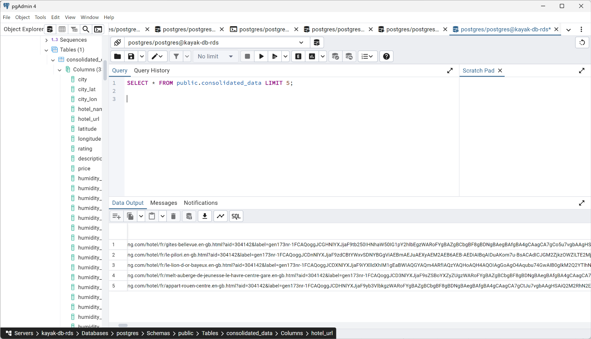
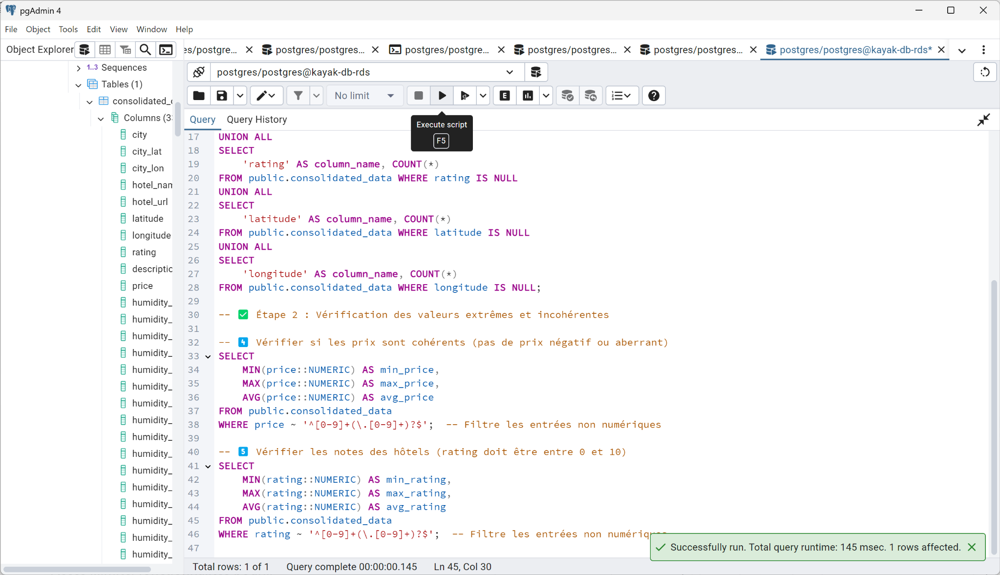

# 🌍 Projet Kayak – Recommandation de Destinations de Vacances

Ce projet a été réalisé dans le cadre d'un projet de certification. Il a pour objectif d'aider l'application Kayak à recommander les **meilleures destinations de vacances en France**, en se basant sur :

- la météo prévisionnelle sur 5 jours,
- les hôtels disponibles avec leurs notes utilisateurs.

---

## 🎯 Objectif

Créer un pipeline complet pour :
- Récupérer les données météo à partir des coordonnées GPS de 35 villes françaises
- Scraper les hôtels disponibles sur Booking.com
- Enrichir les données manquantes via API Google Maps
- Fusionner toutes les données dans un fichier `consolidated_data_utf8.csv`
- Visualiser les résultats (Top 5 destinations, Top 20 hôtels)
- Stocker les données sur AWS (S3 + PostgreSQL RDS)

---

## 🧱 Structure du projet

```
scraping_booking/
├── booking_scraping/              # Scrapy spider (Booking.com)
├── data/
│   ├── raw/                       # Données sources (météo, villes, hôtels)
│   └── processed/                 # Données enrichies et consolidées
├── database/                      # Script SQL et transfert S3 → RDS
├── images/                        # Captures d'écran S3 / RDS
├── notebooks/
│   └── kayak_exploration_final.ipynb  # Visualisations finales
├── scripts/
│   ├── extraction/                # Récupération GPS & météo
│   ├── enrichment/               # Correction des lat/lon via Google
│   ├── consolidation/            # Fusion des datasets
│   └── conversion/               # Conversion UTF-8, table SQL
├── .env.example                   # Variables d’environnement à créer
├── .gitignore
└── README.md
```

---

## ⚙️ Technologies utilisées

- Python / Pandas / Requests
- Plotly pour les cartes interactives
- Scrapy + Playwright (pour Booking)
- OpenWeatherMap API
- Google Maps API
- AWS S3 & RDS PostgreSQL
- Jupyter Notebook (visualisation)
- VSCode + venv (environnement local)

---

## 🔄 Pipeline de traitement

1. **Extraction GPS** : via API Nominatim (`get_city_gps.py`)
2. **Données météo** : via OpenWeather (`get_city_weather.py`)
3. **Scraping hôtels** : spider Booking (`booking_spider.py`)
4. **Enrichissement coordonnées manquantes** : API Google (`api_google_missing_longitudes.py`)
5. **Fusion et nettoyage** : dans `consolidated_data_utf8.csv`
6. **Export AWS** : envoi sur S3 puis import dans RDS via `create_table.sql`

---

## 📊 Visualisations (notebook)

Notebook final 👉 `kayak_exploration_final.ipynb`  
Contient :
- Carte des **Top 5 villes les plus favorables**
- Carte des **Top 20 hôtels selon les notes**
- Analyses complémentaires (températures, distribution...)

---

## ☁️ Intégration Cloud (preuve)

### 🗃️ Bucket S3 avec les fichiers :


### 🧮 Table PostgreSQL dans pgAdmin :


### 🔎 Données vérifiées :


---

## ⚙️ Installation locale

1. Cloner le repo :
```bash
git clone https://github.com/votre-utilisateur/kayak_project.git
cd kayak_project
```

2. Créer un `.env` à la racine :
```
OPENWEATHER_API_KEY=your_key_here
```

3. Installer les dépendances :
```bash
pip install -r requirements.txt
```

4. Lancer les notebooks ou les scripts étape par étape.

---

## ✅ Auteur
Projet réalisé par [Ton Nom] dans le cadre de la certification Data.